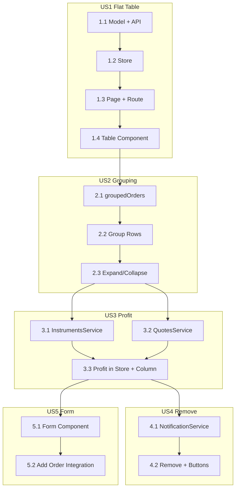

# Orders Feature -- Detailed Implementation Plan

Iterative delivery broken into 5 user stories, each split into minimal subtasks. Every subtask is shippable as a separate PR with visible or testable value.

## Data Sources

- Orders: `https://geeksoft.pl/assets/2026-task/order-data.json` -- `{ data: Order[] }`
- Instruments: `https://geeksoft.pl/assets/2026-task/instruments.json` -- `Instrument[]`
- Contract types: `https://geeksoft.pl/assets/2026-task/contract-types.json` -- `ContractType[]`
- WebSocket quotes: `wss://webquotes.geeksoft.pl/websocket/quotes`

## Target structure

```
src/app/
  core/
    models/order.model.ts
    orders/orders-api.service.ts
    orders/orders.store.ts
    orders/instruments.service.ts   (US3)
    orders/quotes.service.ts       (US3)
    orders/notification.service.ts (US4)
  features/orders/
    orders.page.ts
    orders-table.component.ts
    order-row.component.ts         (US4, extracted)
    new-order-form.component.ts    (US5)
```

---

## US1: Static orders table with flat list

**Goal:** Fetch orders from API and display them in a styled table.

### [*] 1.1 Model + API service

- Add `Order` interface in `core/models/order.model.ts` (fields from order-data.json)
- Create `OrdersApiService` with `fetchOrders()` (HTTP GET)
- Add `provideHttpClient(withFetch())` to `app.config.ts`
- Unit test: mock `HttpClient`, verify `fetchOrders()` returns mapped `Order[]`

**Deliverable:** PR "Add Order model and OrdersApiService"

### [*] 1.2 State layer

- Create `OrdersStore` (`providedIn: 'root'`): `orders` signal, `loadOrders()` calling API
- Inject `OrdersApiService` in store, map response to `Order[]`
- Unit test: mock API, verify `orders` updates after `loadOrders()`

**Deliverable:** PR "Add OrdersStore with signal state"

### [ ] 1.3 Orders page + routing

- Create `OrdersPage` (standalone), inject store, call `loadOrders()` in `effect` or `ngOnInit`
- Add lazy route `/orders`, redirect `''` → `'/orders'`
- Minimal template: `@if` loading / error / `orders().length` count (no table yet)
- Verify route works and page shows "Loaded X orders" or similar

**Deliverable:** PR "Add /orders page with data loading"

### [ ] 1.4 Orders table component

- Create `OrdersTableComponent` with input `orders: Order[]`
- Flat `<table>`: Symbol, Open Time, Open Price, Side, Size, Swap
- Format `openTime` as `dd.MM.yyyy HH:mm:ss` via `DatePipe`
- Style with `--color-row-bg`, `--color-row-bg-hover`, `--color-text`
- Use `OrdersTableComponent` in `OrdersPage`

**Deliverable:** PR "Add OrdersTableComponent with styled flat list"

---

## US2: Group orders by symbol with expand/collapse

**Goal:** Orders grouped by symbol; expand/collapse to show details.

### [ ] 2.1 Grouped data in store

- Add `groupedOrders` computed in `OrdersStore` — group by `symbol`
- Each group: `{ symbol, orders, avgOpenPrice, sumSize, sumSwap }`
- Unit test: verify grouping correctness for sample data

**Deliverable:** PR "Add groupedOrders computed to OrdersStore"

### [ ] 2.2 Table shows group rows

- Refactor `OrdersTableComponent` to consume `groupedOrders` instead of flat list
- Render group rows only (symbol, count, avg openPrice, sum size, sum swap)
- Group rows visually distinct (bold, different bg)
- No expand yet — only summary rows

**Deliverable:** PR "Display grouped orders in table"

### [ ] 2.3 Expand/collapse interaction

- Add `expandedGroups` signal in table component for expanded symbol IDs
- Toggle on group row click; group row has `role="button"`, `aria-expanded`
- When expanded, render order rows under group row
- Format `openTime` in order rows as before
- Keyboard support (Enter/Space)

**Deliverable:** PR "Add expand/collapse for order groups"

---

## US3: Real-time profit via WebSocket

**Goal:** Profit column calculated from WebSocket bid prices.

### [ ] 3.1 Instruments service

- Add `Instrument`, `ContractType` to `order.model.ts`
- Create `InstrumentsService`: fetch instruments + contract-types, build `Map<string, number>` (symbol → contractSize)
- Unit test: verify map for known symbol
- No UI yet — just service + tests

**Deliverable:** PR "Add InstrumentsService for symbol→contractSize"

### [ ] 3.2 Quotes service (WebSocket)

- Add `Quote` to `order.model.ts`
- Create `QuotesService`: connect to `wss://webquotes.geeksoft.pl/websocket/quotes`
- `subscribe(symbols)`, `unsubscribe(symbols)` with correct message format
- Expose `quotes` signal: `Map<string, number>` (symbol → bid)
- SSR-safe: `isPlatformBrowser` guard
- Unit test: mock WebSocket, verify subscribe/unsubscribe messages

**Deliverable:** PR "Add QuotesService with WebSocket subscription"

### [ ] 3.3 Profit in store + column

- Extend store: `loadAll()` fetches orders + instruments, subscribes quotes for unique symbols
- Add computed profit per order: `(bid - openPrice) * size * contractSize * sideMultiplier`
- Group profit = sum of order profits
- Add Profit column to table, color with `--color-profit-positive` / `--color-profit-negative`
- Cleanup: unsubscribe on route destroy / component destroy

**Deliverable:** PR "Add real-time profit column via WebSocket"

---

## US4: Remove orders and groups with notification

**Goal:** Close button on each row; snackbar on remove.

### [ ] 4.1 Notification service + snackbar UI

- Create `NotificationService` with `show(message: string)`
- Simple snackbar: signal for message + visibility, auto-dismiss ~3s
- Provide at root, render snackbar in `AppComponent` or layout
- Manually test: `notification.show('Test')` from console or dev button
- Accessible: `role="status"`, `aria-live="polite"`

**Deliverable:** PR "Add NotificationService and snackbar UI"

### [ ] 4.2 Remove order + group + close buttons

- Add `removeOrder(id)`, `removeGroup(symbol)` to `OrdersStore`
- Unsubscribe quotes when symbol has no orders left
- Add close button to each order row and group row; `aria-label`
- Wire button → store.remove → `notification.show('Zamknięto zlecenie nr ...')`

**Deliverable:** PR "Add remove order/group with snackbar message"

---

## US5: New order form

**Goal:** Form to add order to local state only.

### [ ] 5.1 Form component with validation

- Create `NewOrderFormComponent` with reactive form
- Fields: symbol (select), side (BUY/SELL), size, openPrice, openTime (read-only or hidden, set on submit)
- Validation: required, size > 0, openPrice > 0
- No submit handler yet — form just validates
- Symbol options: pass as input or derive from store

**Deliverable:** PR "Add NewOrderFormComponent with validation"

### [ ] 5.2 Add order to store + integration

- Add `addOrder(payload)` to `OrdersStore`: generate ID, push to `orders`, subscribe WebSocket if new symbol
- Wire form submit → `store.addOrder()` → reset form
- Place form above table on orders page
- openPrice pre-filled from quotes when symbol selected (optional enhancement)

**Deliverable:** PR "Integrate new order form with OrdersStore"

---

## Dependency graph



---

## Summary of subtasks (14 PRs)

| # | Status | Subtask | PR title |
|---|--------|---------|----------|
| 1.1 | [*] | Model + API service | Add Order model and OrdersApiService |
| 1.2 | [*] | State layer | Add OrdersStore with signal state |
| 1.3 | [ ] | Page + routing | Add /orders page with data loading |
| 1.4 | [ ] | Table component | Add OrdersTableComponent with styled flat list |
| 2.1 | [ ] | groupedOrders in store | Add groupedOrders computed to OrdersStore |
| 2.2 | [ ] | Group rows in table | Display grouped orders in table |
| 2.3 | [ ] | Expand/collapse | Add expand/collapse for order groups |
| 3.1 | [ ] | InstrumentsService | Add InstrumentsService for symbol→contractSize |
| 3.2 | [ ] | QuotesService | Add QuotesService with WebSocket subscription |
| 3.3 | [ ] | Profit column | Add real-time profit column via WebSocket |
| 4.1 | [ ] | NotificationService | Add NotificationService and snackbar UI |
| 4.2 | [ ] | Remove + buttons | Add remove order/group with snackbar message |
| 5.1 | [ ] | Form component | Add NewOrderFormComponent with validation |
| 5.2 | [ ] | Form integration | Integrate new order form with OrdersStore |
